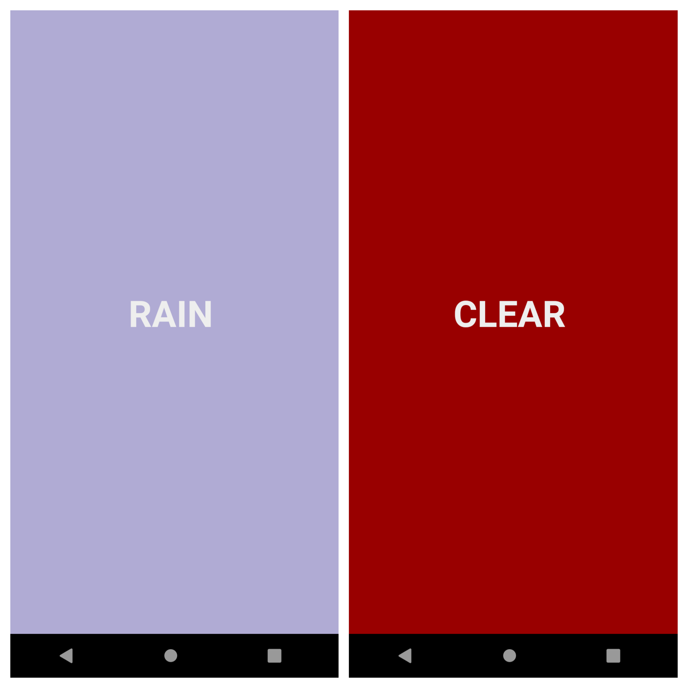

## Weather Sample App

This is a sample project, exploring the use of Dagger, RxJava, Retrofit, ViewModel, and LiveData.

It is written in Kotlin, and is test-driven, making use of JUnit, Mockito, and Espresso.

The app is a simple take on the numerous weather apps out there. It fetches the weather, displays a simple text description and changes the background colour according to the temperature.

### Notes:
- `android:usesCleartextTraffic="true"` - (for API level 23+) this is because MockWebServer uses plain text communication by default. Having this property set is not ideal for a release build. ~~A solution would involve generating and applying our own SSL certificate which ventures out of the scope of this project.~~ Now uses manifest merging as a solution.
- `WeatherViewModel` should have been driven out by a unit test but was instead driven out by the instrumentation test for `MainActivity`.
- *ACCESS_FINE_LOCATION* is used instead of *ACCESS_COARSE_LOCATION*. While using a coarse location would be ideal for this kind of application, the location services (in Google Play Services) were not picking up inputted gps coordinates on my emulator (Nexus 5 Android Pie) when requesting a coarse location.
- The case where the location permission is *not* granted by the user is currently not handled by the application.
- The `dagger-android` package could have been used to inject dependencies of the android classes but was omitted to avoid adding an extra level of complexity. This could have been used to prevent them from having an awareness of their injector. A trade-off was made here.
- The temperature colour is currently interpolated over **ARGB** values, this could have been done over **HSV** values instead to create more appealing colours.